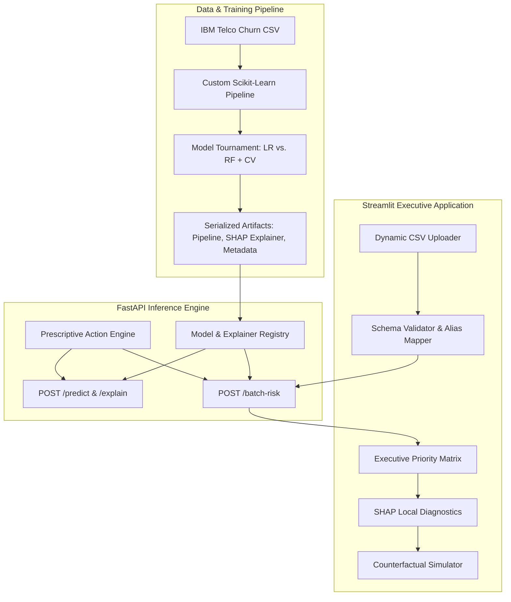
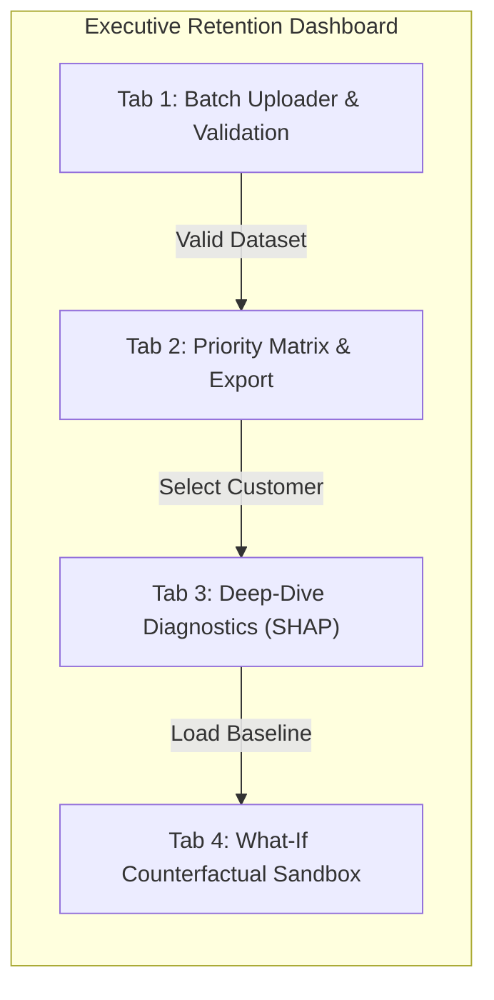

# Customer Churn Decision Engine: End-to-End Technical Execution Blueprint
**Role Context:**Senior Machine Learning Engineer & Full-Stack Data Solutions Architect
**Project Goal:**Transform static churn analysis into an enterprise-grade retention decision engine featuring dynamic CSV uploads, automated schema validation, SHAP explainability, and counterfactual"What-If" simulations.
---

---
## 1. Repository & Folder Structure
```text
churn-decision-engine/
├── .github/
│   └── workflows/
│       └── ci-cd.yml                   # Linting, unit tests, and Docker container build
├── data/
│   ├── raw/
│   │   └── WA_Fn-UseC_-Telco-Customer-Churn.csv
│   ├── processed/
│   │   └── train_test_split.parquet
│   └── sample_uploads/
│       ├── enterprise_sample_valid.csv
│       └── dirty_sample_with_missing_cols.csv
├── notebooks/
│   ├── 01_eda_and_data_profiling.ipynb
│   ├── 02_model_experimentation_and_tuning.ipynb
│   └── 03_shap_explainability_audit.ipynb
├── models/
│   ├── churn_pipeline.joblib           # Preprocessor + Champion Classifier
│   ├── shap_explainer.joblib           # Pre-computed TreeExplainer + background data
│   └── model_metadata.json             # Metrics, optimal threshold, feature lists
├── src/
│   ├── __init__.py
│   ├── config.py                       # Global configs, paths, column mappings, risk thresholds
│   ├── data/
│   │   ├── __init__.py
│   │   ├── cleaner.py                  # TotalCharges coercion, whitespace stripping
│   │   ├── feature_engineering.py      # Tenure cohorts, service density, ratio features
│   │   └── validator.py                # Schema definition, alias matching, type casting
│   ├── models/
│   │   ├── __init__.py
│   │   ├── train.py                    # Cross-validation, hyperparameter sweep, artifact saving
│   │   ├── evaluate.py                 # Precision-Recall curves, cost-benefit optimization
│   │   └── pipeline.py                 # ColumnTransformer and Pipeline composition
│   ├── explainability/
│   │   ├── __init__.py
│   │   ├── shap_service.py             # Global and local SHAP computation
│   │   └── rules.py                    # Rule-based Prescriptive Action Engine (Next-Best-Action)
│   └── utils/
│       ├── __init__.py
│       └── logger.py                   # Structured JSON logging
├── app/
│   ├── api/
│   │   ├── __init__.py
│   │   ├── main.py                     # FastAPI entrypoint, lifespan startup, CORS
│   │   ├── schemas.py                  # Pydantic v2 request/response schemas
│   │   └── routes/
│   │       ├── predict.py              # Single-record scoring
│   │       ├── explain.py              # Single-record SHAP force/waterfall values
│   │       └── batch.py                # Multipart CSV upload and batch processing
│   └── dashboard/
│       ├── app.py                      # Streamlit multi-page / tab dashboard
│       ├── components/
│       │   ├── uploader.py             # Drag-and-drop CSV validator UI
│       │   ├── priority_matrix.py      # High-risk sorted table + CSV exporter
│       │   ├── diagnostics.py          # SHAP waterfall plots & driver breakdowns
│       │   └── simulator.py            # "What-If" counterfactual retention sandbox
│       └── styles.py                   # Custom CSS (executive typography, metrics cards)
├── tests/
│   ├── test_pipeline.py                # Test transformation idempotency and NaN safety
│   ├── test_validator.py               # Test column alias matching and missing field alerts
│   ├── test_api.py                     # Test FastAPI endpoints with Mock payloads
│   └── test_rules.py                   # Test Prescriptive Decision Engine rule activations
├── .gitignore
├── Dockerfile
├── docker-compose.yml
├── Makefile                            # Commands: make train, make run-api, make run-ui, make test
├── pyproject.toml
└── requirements.txt
```
---
## 2. Phase-by-Phase Execution Plan
### Phase 1: Exploratory Data Analysis & Robust Pipeline Construction
1.**Anomaly Resolution & Type Hygiene:**
   - Detect and resolve the critical IBM Telco flaw:`TotalCharges` contains`11` whitespace entries (`" "`) corresponding to customers with`tenure == 0`. Force-coerce these to`0.0` or float`NaN`, followed by median imputation.
   - Drop the arbitrary identifier`customerID` from the feature matrix while persisting it as an index key for tracking.
2.**Domain-Driven Feature Engineering:**
   -**Tenure Cohorts:**Discretize tenure into operational stages (`0-12m`,`13-24m`,`25-48m`,`49-72m`).
   -**Service Density Score:**Count of subscribed digital add-ons (`OnlineSecurity`,`OnlineBackup`,`DeviceProtection`,`TechSupport`,`StreamingTV`,`StreamingMovies`) to measure product stickiness.
   -**Charge Velocity:**Ratio of`MonthlyCharges` to`TotalCharges` normalized against`tenure` to isolate rapid price inflation.
   -**High-Risk Flags:**Boolean flag for`Month-to-month` contract combined with`Electronic check` payment method.
3.**Unified Scikit-Learn Pipeline:**
   - Construct custom transformers inheriting from`BaseEstimator` and`TransformerMixin`.
   - Segment transformations via`ColumnTransformer`:
     -**Numerical:**`SimpleImputer(strategy='median')` $\rightarrow$`StandardScaler()`.
     -**Categorical:**`SimpleImputer(strategy='most_frequent')` $\rightarrow$`OneHotEncoder(handle_unknown='ignore', sparse_output=False)`.
   - Prevent all data leakage: Fit transformers exclusively on`X_train` and serialize the complete pipeline via`joblib`.
---
### Phase 2: Model Training, Cost-Sensitive Optimization & Cross-Validation
1.**Model Tournament:**
   -**Baseline:**`LogisticRegression(class_weight='balanced', solver='liblinear', max_iter=1000)` to establish an interpretable linear odds-ratio benchmark.
   -**Champion:**`RandomForestClassifier(n_estimators=300, max_depth=12, min_samples_split=5, class_weight='balanced_subsample', random_state=42)`.
2.**Cross-Validation & Imbalance Strategy:**
   - Implement a 5-fold`StratifiedKFold` CV scheme to preserve the ~26.5% churn distribution across splits.
   - Integrate`imbalanced-learn` within an`imblearn.pipeline.Pipeline` using`SMOTENC` on categorical-encoded training folds to evaluate synthetic oversampling against pure algorithmic cost weighting (`class_weight='balanced'`).
3.**Business-Oriented Metric Optimization:**
   - Accuracy is strictly deprioritized due to class imbalance and asymmetric business costs:
     -**False Negative (FN):**At-risk customer undetected $\rightarrow$ Loss of entire Customer Lifetime Value (CLV $\approx-\$500$).
     -**False Positive (FP):**Loyal customer misclassified as at-risk $\rightarrow$ Cost of unnecessary retention discount ($\approx-\$35$).
   - Execute Precision-Recall threshold calibration: Replace the default $0.5$ decision threshold with the cost-minimizing threshold $\tau^*$ derived by maximizing $F_{\beta}$ ($\beta=2$, weighting Recall over Precision) and minimizing expected financial loss.
---
### Phase 3: Explainability & Prescriptive Action Engine
1.**SHAP Integration:**
   -**Global Audit:**Generate summary beeswarm plots and mean absolute SHAP feature importance to validate model alignment with business logic.
   -**Local Inference:**Initialize`shap.TreeExplainer` on the Random Forest model. To ensure sub-100ms API latency, pre-compute a reference background matrix using $K$-Means clustering ($k=50$) on the preprocessed training set.
2.**Automated"Next-Best-Action" Decision Matrix:**
   - The engine evaluates the customer's predicted risk alongside their dominant positive SHAP features to trigger targeted retention playbooks:

| Churn Risk Tier | Dominant Risk Factor (SHAP Driver) | Prescribed Retention Playbook (Next-Best-Action) | Projected Cost / Incentive |
| :--- | :--- | :--- | :--- |
| **Critical ($P \ge 0.70$)** | `Contract` is Month-to-month | Auto-generate 1-Year Contract Upgrade Offer with 15% monthly discount lock-in. | Moderate ($\approx \$10-\$15/\text{mo}$) |
| **Critical ($P \ge 0.70$)** | `PaymentMethod` is Electronic Check | Deliver push notification / email offering \$20 one-time billing credit upon switching to Auto-Pay via Bank/Credit Card. | Low ($\approx \$20$ one-time) |
| **Moderate ($0.40 \le P < 0.70$)** | `TechSupport` / `OnlineSecurity` = No | Trigger Customer Success outreach offering free 3-month VIP TechSupport onboarding. | Zero-marginal cost |
| **Moderate ($0.40 \le P < 0.70$)** | `MonthlyCharges` high relative to Tenure | Route to retention specialist for personalized loyalty bundle repackaging. | Variable |
| **Low ($P < 0.40$)** | Organic retention / Low churn risk | No aggressive retention intervention; route to standard upsell/cross-sell nurture stream. | \$0 |

---

### Phase 4: Production FastAPI Architecture
1. **Application Lifecycle (`@asynccontextmanager`):**
   - Pre-load `churn_pipeline.joblib`, `shap_explainer.joblib`, and `model_metadata.json` into memory on application startup to eliminate per-request disk I/O overhead.
2. **Core Endpoint Suite:**
   - `POST /predict`: Ingests single customer JSON, returns churn probability, calibrated binary label, and risk tier.
   - `POST /explain`: Ingests customer attributes, executes `TreeExplainer`, and returns the expected base value, local prediction score, and top $K$ risk-increasing and risk-decreasing features with their respective SHAP values.
   - `POST /batch-risk`: Ingests multipart CSV uploads, validates schemas, executes batch inference via vectorization, appends top SHAP drivers and prescribed actions, and returns an enriched dataset.
   - `GET /health` & `GET /metadata`: Exposes model version, training metrics, and schema specifications.

---

### Phase 5: Streamlit Interactive Executive Dashboard



1. **Dynamic File Upload & Schema Validation:**
   - Ingest arbitrary user CSVs.
   - Compare uploaded column names against canonical expected schema.
   - Implement **fuzzy alias matching** (e.g., map `monthly_charges`, `Monthly_Charge`, or `monthlyspend` to `MonthlyCharges`).
   - Display dynamic validation alerts: Warn about missing non-critical columns that will be imputed, and block execution with explicit error prompts if core features are absent.
2. **Executive Priority Matrix:**
   - Sort customers descending by churn probability.
   - KPI Metrics: Total Analyzed Accounts, At-Risk Accounts ($P > \tau^*$), Total Monthly Revenue at Risk ($\sum \text{MonthlyCharges}_{\text{churn}}$), and Projected Recoverable MRR.
   - Export enriched CSV with risk scores, assigned risk tiers, top 3 SHAP drivers, and the automated Next-Best-Action recommendation.
3. **Individual Customer Diagnostics:**
   - Dropdown search by `customerID`.
   - KPI cards for Current Plan, Monthly Charges, and Total Tenure.
   - Embedded Matplotlib-rendered **SHAP Waterfall Plot** showing the exact push-and-pull of each feature driving the risk score from base value $E[f(x)]$ to $f(x)$.
4. **Interactive "What-If" Counterfactual Simulator:**
   - Stateful controls (`st.session_state`) pre-filled with the selected customer’s actual profile.
   - Live interactive widgets allowing executive account managers to simulate interventions:
     - Upgrade Contract: `Month-to-month` $\rightarrow$ `One year` or `Two year`.
     - Modify Monthly Charges via discount slider ($\Delta \text_Discount$).
     - Toggle Add-ons (`TechSupport`, `OnlineSecurity`) from `No` to `Yes`.
     - Switch `PaymentMethod` to `Bank transfer (automatic)`.
   - Real-time recalculation rendering immediate visual feedback:  
     *e.g., "Intervention reduces Churn Risk from 82.4% to 28.1% ($-54.3\%$ drop). Status shifts from CRITICAL to LOW."*

---

## 3. Key Technical Code Snippets

### A. Scikit-Learn Pipeline Serialization/Deserialization & Custom Preprocessing

```python
# File: src/models/pipeline.py
import joblib
import numpy as np
import pandas as pd
from sklearn.base import BaseEstimator, TransformerMixin
from sklearn.compose import ColumnTransformer
from sklearn.ensemble import RandomForestClassifier
from sklearn.impute import SimpleImputer
from sklearn.pipeline import Pipeline
from sklearn.preprocessing import OneHotEncoder, StandardScaler

# Define Canonical Column Subsets
NUMERIC_FEATURES = ["tenure", "MonthlyCharges", "TotalCharges"]
CATEGORICAL_FEATURES = [
    "gender", "SeniorCitizen", "Partner", "Dependents", "PhoneService",
    "MultipleLines", "InternetService", "OnlineSecurity", "OnlineBackup",
    "DeviceProtection", "TechSupport", "StreamingTV", "StreamingMovies",
    "Contract", "PaperlessBilling", "PaymentMethod"
]


class TelcoDataCleaner(BaseEstimator, TransformerMixin):
    """Clean blank strings in TotalCharges and handle zero-tenure customers."""
    def fit(self, X: pd.DataFrame, y=None):
        return self

    def transform(self, X: pd.DataFrame) -> pd.DataFrame:
        X_out = X.copy()
        if "TotalCharges" in X_out.columns:
            # Coerce empty whitespace strings to NaN then zero (zero tenure)
            X_out["TotalCharges"] = pd.to_numeric(
                X_out["TotalCharges"].replace(r"^\s*$", np.nan, regex=True),
                errors="coerce"
            ).fillna(0.0)
        return X_out


class TelcoFeatureEngineer(BaseEstimator, TransformerMixin):
    """Derive operational features without introducing lookahead bias."""
    def fit(self, X: pd.DataFrame, y=None):
        return self

    def transform(self, X: pd.DataFrame) -> pd.DataFrame:
        X_out = X.copy()
        # Service count density
        services = [
            "OnlineSecurity", "OnlineBackup", "DeviceProtection",
            "TechSupport", "StreamingTV", "StreamingMovies"
        ]
        available_services = [s for s in services if s in X_out.columns]
        if available_services:
            X_out["ServiceCount"] = (X_out[available_services] == "Yes").sum(axis=1)
        
        # Monthly to Total charge velocity
        if "MonthlyCharges" in X_out.columns and "TotalCharges" in X_out.columns:
            X_out["ChargeRatio"] = X_out["MonthlyCharges"] / (X_out["TotalCharges"] + 1.0)
            
        return X_out


def build_full_churn_pipeline() -> Pipeline:
    """Builds end-to-end production model pipeline."""
    # Extended numeric features post-engineering
    extended_numeric = NUMERIC_FEATURES + ["ServiceCount", "ChargeRatio"]

    numeric_transformer = Pipeline([
        ("imputer", SimpleImputer(strategy="median")),
        ("scaler", StandardScaler())
    ])

    categorical_transformer = Pipeline([
        ("imputer", SimpleImputer(strategy="most_frequent")),
        ("onehot", OneHotEncoder(handle_unknown="ignore", sparse_output=False))
    ])

    preprocessor = ColumnTransformer(
        transformers=[
            ("num", numeric_transformer, extended_numeric),
            ("cat", categorical_transformer, CATEGORICAL_FEATURES)
        ],
        remainder="drop"
    )

    full_pipeline = Pipeline([
        ("cleaner", TelcoDataCleaner()),
        ("engineer", TelcoFeatureEngineer()),
        ("preprocessor", preprocessor),
        ("classifier", RandomForestClassifier(
            n_estimators=300,
            max_depth=12,
            min_samples_split=5,
            class_weight="balanced_subsample",
            random_state=42,
            n_jobs=-1
        ))
    ])
    return full_pipeline


def save_pipeline_bundle(pipeline: Pipeline, metadata: dict, filepath: str) -> None:
    """Serialize pipeline and operational metadata via joblib."""
    bundle = {
        "pipeline": pipeline,
        "metadata": metadata
    }
    joblib.dump(bundle, filepath, compress=3)


def load_pipeline_bundle(filepath: str) -> tuple[Pipeline, dict]:
    """Safely deserialize pipeline and metadata."""
    bundle = joblib.load(filepath)
    return bundle["pipeline"], bundle["metadata"]
```

---

### B. Streamlit Dynamic CSV Uploader with Robust Schema Validation & Alias Matching

```python
# File: app/dashboard/components/uploader.py
import io
import re
import pandas as pd
import streamlit as st

# Canonical schema definition
REQUIRED_COLUMNS = {
    "tenure": "numeric",
    "MonthlyCharges": "numeric",
    "TotalCharges": "numeric",
    "Contract": "categorical",
    "InternetService": "categorical",
    "PaymentMethod": "categorical"
}

# Alias dictionary to absorb messy customer column naming variations
COLUMN_ALIASES = {
    "tenure": ["tenure", "months_active", "customer_tenure", "tenure_months"],
    "MonthlyCharges": ["monthlycharges", "monthly_charges", "monthly_spend", "mrr"],
    "TotalCharges": ["totalcharges", "total_charges", "total_spend", "cumulative_revenue"],
    "Contract": ["contract", "contract_type", "term", "subscription_type"],
    "InternetService": ["internetservice", "internet_service", "connection_type"],
    "PaymentMethod": ["paymentmethod", "payment_method", "billing_type"]
}


def normalize_string(val: str) -> str:
    """Normalize string by removing underscores, spaces, and casing."""
    return re.sub(r"[_\s\-]+", "", val).lower()


def validate_and_align_dataset(df: pd.DataFrame) -> tuple[pd.DataFrame | None, list[str], list[str]]:
    """
    Validates uploaded DataFrame, resolves column aliases,
    and returns (aligned_df, missing_required_columns, warnings).
    """
    warnings = []
    missing_required = []
    aligned_df = df.copy()

    # Map existing columns by normalized match
    normalized_incoming = {normalize_string(col): col for col in aligned_df.columns}
    rename_mapping = {}

    for canonical, aliases in COLUMN_ALIASES.items():
        found = False
        for alias in aliases:
            norm_alias = normalize_string(alias)
            if norm_alias in normalized_incoming:
                original_col = normalized_incoming[norm_alias]
                rename_mapping[original_col] = canonical
                found = True
                break
        if not found and canonical in REQUIRED_COLUMNS:
            missing_required.append(canonical)

    aligned_df = aligned_df.rename(columns=rename_mapping)

    # Validate data types for detected numeric columns
    for col, expected_type in REQUIRED_COLUMNS.items():
        if col in aligned_df.columns and expected_type == "numeric":
            # Coerce errors to NaN to verify parsability
            initial_nans = aligned_df[col].isna().sum()
            numeric_series = pd.to_numeric(aligned_df[col].astype(str).str.strip(), errors="coerce")
            new_nans = numeric_series.isna().sum() - initial_nans
            if new_nans > 0:
                warnings.append(f"Column '{col}' contained {new_nans} non-numeric values converted to NaN.")
            aligned_df[col] = numeric_series

    if missing_required:
        return None, missing_required, warnings

    return aligned_df, [], warnings


def render_dynamic_uploader() -> pd.DataFrame | None:
    """Streamlit dynamic uploader UI component."""
    st.subheader("📂 Upload Dynamic Customer Dataset")
    uploaded_file = st.file_uploader(
        "Upload Customer CSV (Batch Inference)",
        type=["csv"],
        help="Upload CSV containing customer billing, contract, and usage records."
    )

    if uploaded_file is None:
        st.info("Awaiting CSV upload. Please upload a file to begin.")
        return None

    try:
        raw_df = pd.read_csv(uploaded_file)
    except Exception as e:
        st.error(f"Error parsing CSV file: {e}")
        return None

    st.write(f"**Uploaded shape:** {raw_df.shape[0]} rows × {raw_df.shape[1]} columns")

    aligned_df, missing_cols, warnings = validate_and_align_dataset(raw_df)

    if missing_cols:
        st.error(
            f"🚫 **Schema Validation Failed!** The uploaded file is missing required columns: "
            f"`{missing_cols}`. Please verify your file or map columns accordingly."
        )
        return None

    for warn in warnings:
        st.warning(f"⚠️ {warn}")

    st.success("✅ **Schema Verified:** All core features successfully mapped and validated.")
    return aligned_df
```

---

### C. Fast SHAP Waterfall Plot Rendering for Individual Customer Records

```python
# File: src/explainability/shap_service.py
import matplotlib.pyplot as plt
import numpy as np
import pandas as pd
import shap
import streamlit as st
from sklearn.pipeline import Pipeline


def get_feature_names_from_preprocessor(preprocessor) -> list[str]:
    """Extract encoded feature names from Scikit-Learn ColumnTransformer."""
    output_features = []
    for name, transformer, columns in preprocessor.transformers_:
        if name == "remainder" and transformer == "drop":
            continue
        if hasattr(transformer, "get_feature_names_out"):
            names = transformer.get_feature_names_out(columns)
            output_features.extend(names)
        else:
            output_features.extend(columns)
    return output_features


def render_customer_shap_waterfall(
    pipeline: Pipeline,
    explainer: shap.TreeExplainer,
    customer_raw_df: pd.DataFrame,
    customer_id: str = "Target Customer"
) -> plt.Figure:
    """
    Transforms raw customer row, computes local SHAP values,
    and returns a formatted Matplotlib Waterfall plot.
    """
    # 1. Isolate transformations up to the classifier
    cleaner = pipeline.named_steps["cleaner"]
    engineer = pipeline.named_steps["engineer"]
    preprocessor = pipeline.named_steps["preprocessor"]

    cleaned_data = cleaner.transform(customer_raw_df)
    engineered_data = engineer.transform(cleaned_data)
    transformed_features = preprocessor.transform(engineered_data)

    # 2. Extract feature names
    feature_names = get_feature_names_from_preprocessor(preprocessor)

    # 3. Compute SHAP values for class 1 (Churn = Yes)
    shap_values = explainer(transformed_features)

    # If binary classifier returns 3D shape (samples, features, classes), slice class 1
    if len(shap_values.values.shape) == 3:
        explanation = shap.Explanation(
            values=shap_values.values[0, :, 1],
            base_values=shap_values.base_values[0, 1],
            data=transformed_features[0],
            feature_names=feature_names
        )
    else:
        explanation = shap.Explanation(
            values=shap_values.values[0],
            base_values=shap_values.base_values[0],
            data=transformed_features[0],
            feature_names=feature_names
        )

    # 4. Generate Waterfall Plot
    fig, ax = plt.subplots(figsize=(9, 5), dpi=150)
    shap.plots.waterfall(explanation, max_display=10, show=False)
    plt.title(f"Root-Cause SHAP Diagnostics: Account {customer_id}", fontsize=12, fontweight="bold", pad=12)
    plt.tight_layout()
    
    return fig
```

---

### D. Streamlit "What-If" Counterfactual Simulator State Management

```python
# File: app/dashboard/components/simulator.py
import copy
import pandas as pd
import streamlit as st
from sklearn.pipeline import Pipeline


def render_what_if_simulator(pipeline: Pipeline, baseline_record: pd.Series):
    """
    Counterfactual retention sandbox enabling real-time intervention testing.
    Maintains clean session state and provides dynamic risk delta metrics.
    """
    st.subheader("🧪 Customer Retention 'What-If' Sandbox")
    st.caption("Simulate contractual, pricing, and service adjustments to evaluate churn risk reduction.")

    # Initialize session state for the selected customer to avoid stale inputs
    cust_id = baseline_record.get("customerID", "Current_Customer")
    if "active_customer_id" not in st.session_state or st.session_state.active_customer_id != cust_id:
        st.session_state.active_customer_id = cust_id
        st.session_state.sim_contract = baseline_record.get("Contract", "Month-to-month")
        st.session_state.sim_monthly = float(baseline_record.get("MonthlyCharges", 65.0))
        st.session_state.sim_tech_support = baseline_record.get("TechSupport", "No")
        st.session_state.sim_payment = baseline_record.get("PaymentMethod", "Electronic check")

    # Layout Simulator Controls
    col1, col2 = st.columns(2)

    with col1:
        sim_contract = st.selectbox(
            "Contract Term Commitment",
            options=["Month-to-month", "One year", "Two year"],
            index=["Month-to-month", "One year", "Two year"].index(st.session_state.sim_contract)
        )
        sim_payment = st.selectbox(
            "Payment Processing Method",
            options=[
                "Electronic check",
                "Mailed check",
                "Bank transfer (automatic)",
                "Credit card (automatic)"
            ],
            index=[
                "Electronic check",
                "Mailed check",
                "Bank transfer (automatic)",
                "Credit card (automatic)"
            ].index(st.session_state.sim_payment)
        )

    with col2:
        sim_monthly = st.slider(
            "Adjusted Monthly Rate ($)",
            min_value=18.0,
            max_value=130.0,
            value=st.session_state.sim_monthly,
            step=1.0,
            help="Simulate applying promotional loyalty discounts."
        )
        sim_tech_support = st.selectbox(
            "Enrolled in VIP Tech Support",
            options=["No", "Yes"],
            index=["No", "Yes"].index(st.session_state.sim_tech_support if st.session_state.sim_tech_support in ["No", "Yes"] else "No")
        )

    # Construct baseline and counterfactual DataFrames
    base_df = pd.DataFrame([baseline_record.to_dict()])
    sim_df = base_df.copy()
    
    # Inject simulated overrides
    sim_df["Contract"] = sim_contract
    sim_df["PaymentMethod"] = sim_payment
    sim_df["MonthlyCharges"] = sim_monthly
    sim_df["TechSupport"] = sim_tech_support

    # Execute predictions
    base_prob = pipeline.predict_proba(base_df)[0][1]
    sim_prob = pipeline.predict_proba(sim_df)[0][1]
    prob_delta = sim_prob - base_prob

    # Display Metrics
    st.markdown("---")
    mcol1, mcol2, mcol3 = st.columns(3)
    mcol1.metric("Baseline Churn Risk", f"{base_prob * 100:.1f}%")
    mcol2.metric(
        "Simulated Churn Risk",
        f"{sim_prob * 100:.1f}%",
        delta=f"{prob_delta * 100:.1f}%",
        delta_color="inverse"
    )
    
    if sim_prob < 0.40 and base_prob >= 0.70:
        badge = "🟢 Strategy Effective: Account de-escalated to SAFE tier."
    elif sim_prob < base_prob:
        badge = "🟡 Moderate Risk Reduction: Requires additional retention incentives."
    else:
        badge = "🔴 Ineffective: Intervention does not overcome core risk factors."

    mcol3.markdown(f"**Outcome Assessment:**<br>{badge}", unsafe_allow_html=True)
```

---

## 4. Production API Specification (FastAPI Boilerplate)

```python
# File: app/api/main.py
from contextlib import asynccontextmanager
import io
import joblib
import pandas as pd
from fastapi import FastAPI, File, HTTPException, UploadFile, status
from pydantic import BaseModel, Field

# Lifespan Application State
ml_models = {}


@asynccontextmanager
async def lifespan(app: FastAPI):
    # Load serialized bundle on startup
    bundle = joblib.load("models/churn_pipeline.joblib")
    ml_models["pipeline"] = bundle["pipeline"]
    ml_models["metadata"] = bundle["metadata"]
    yield
    ml_models.clear()


app = FastAPI(
    title="Customer Churn Decision Engine API",
    version="1.0.0",
    lifespan=lifespan
)


class CustomerRecord(BaseModel):
    tenure: int = Field(..., ge=0, example=12)
    MonthlyCharges: float = Field(..., ge=0.0, example=70.35)
    TotalCharges: float | str = Field(..., example=840.20)
    Contract: str = Field(..., example="Month-to-month")
    InternetService: str = Field(..., example="Fiber optic")
    PaymentMethod: str = Field(..., example="Electronic check")
    TechSupport: str = Field(default="No", example="No")
    OnlineSecurity: str = Field(default="No", example="No")


class PredictionResult(BaseModel):
    churn_probability: float
    is_at_risk: bool
    risk_tier: str
    decision_threshold_applied: float


@app.post("/predict", response_model=PredictionResult)
def predict_single(record: CustomerRecord):
    pipeline = ml_models.get("pipeline")
    threshold = ml_models.get("metadata", {}).get("optimal_threshold", 0.45)

    if not pipeline:
        raise HTTPException(status_code=503, detail="Model pipeline is unavailable.")

    df_input = pd.DataFrame([record.model_dump()])
    try:
        prob = float(pipeline.predict_proba(df_input)[0][1])
    except Exception as e:
        raise HTTPException(status_code=422, detail=f"Inference pipeline execution failed: {e}")

    tier = "Critical" if prob >= 0.70 else ("Moderate" if prob >= 0.40 else "Low")
    return PredictionResult(
        churn_probability=round(prob, 4),
        is_at_risk=prob >= threshold,
        risk_tier=tier,
        decision_threshold_applied=threshold
    )


@app.post("/batch-risk")
async def batch_risk(file: UploadFile = File(...)):
    if not file.filename.endswith(".csv"):
        raise HTTPException(status_code=400, detail="Only CSV uploads are supported.")

    contents = await file.read()
    try:
        df = pd.read_csv(io.StringIO(contents.decode("utf-8")))
    except Exception as e:
        raise HTTPException(status_code=400, detail=f"Malformed CSV: {e}")

    pipeline = ml_models.get("pipeline")
    threshold = ml_models.get("metadata", {}).get("optimal_threshold", 0.45)

    probs = pipeline.predict_proba(df)[:, 1]
    df["churn_probability"] = probs.round(4)
    df["is_at_risk"] = df["churn_probability"] >= threshold
    df["risk_tier"] = df["churn_probability"].apply(
        lambda p: "Critical" if p >= 0.70 else ("Moderate" if p >= 0.40 else "Low")
    )

    # Sort descending by risk score
    ranked_df = df.sort_values(by="churn_probability", ascending=False)
    return ranked_df.to_dict(orient="records")
```

---

## 5. Course Project Milestone Execution Roadmap

| Milestone | Deliverables | Verification & Success Gate |
| :--- | :--- | :--- |
| **Milestone 1: Foundations** | Data cleaning, EDA notebook, feature engineering pipeline, unit tests. | Clean transformation pass across `TotalCharges` whitespace rows; zero pipeline leakage. |
| **Milestone 2: Modeling** | Stratified CV tournament, Random Forest vs. Logistic Regression, threshold tuning. | Random Forest PR-AUC $\ge 0.65$; cost-optimal threshold selected via $F_2$ maximization. |
| **Milestone 3: Engine Logic** | SHAP `TreeExplainer` background generation, Prescriptive Action rule module. | Sub-100ms local SHAP calculation; deterministic rule assignment across risk tiers. |
| **Milestone 4: Backend API** | FastAPI application (`/predict`, `/explain`, `/batch-risk`), Pydantic schemas. | 100% test coverage on API routes; proper HTTP 422 error handling for invalid schemas. |
| **Milestone 5: Dashboard** | Streamlit UI: Dynamic CSV uploader, Priority Matrix, Waterfall diagnostics, What-If simulator. | Flawless end-to-end user journey: upload raw CSV $\rightarrow$ view priority accounts $\rightarrow$ simulate interventions. |
